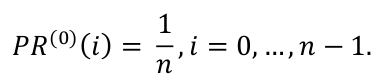
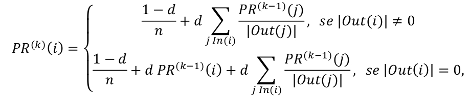

# Google’s PageRank
First work in CS Course, implementing first algorithm used from Google to **rank web searchs**, the PageRank. 
In this problem, there are N pages, each one having at most N-1 linked output pages. 
We want to know **which order to show** the user in its web search, based on the pages relevance. 
The iterative method for calculating the PageRank is implemented here, known as "Power Method".

## How to run?

1 - Make sure gcc and makefile are both installed in your machine.  
2 - Assert that input file "input.txt" is in the same folder as **"pagerank.c"**.  
3 - Run this command in bash:
```
make
```
In case neither gcc or makefile are installed:
```
sudo apt-get install gcc
sudo apt-get install make
```
## Example

Consider the following instance, with five pages and its output liked pages as shown below:

<p align="center">
  
</p>

For each page, its PageRank value PR(i) is initialized as:

<p align="center">
  
</p>

At each iteration k, the PR(i) values are refreshed following this rule:

<p align="center">
  
</p>

In the definition above:  
• **PR(i)** denotes the PageRank of page i;  
• **n** is total number of pages;  
• **d** is a parameter, between 0 and 1. Normally, it is worth 0.85.  
• **In (k)** is the set of all pages that link to page k;  
• **Out (k)** is the set of all pages with a link coming out of page k;  
• **|Y|** denotes the number of elements in any set Y.  

The "Power Method" stops the calculation when the condition E(k) < ε = 10-6 is achieved, being E(k) described as follows: 
<p align="center">
  
</p>

After this condition is achieved, the program outputs the desired sequence:
```
Ordered Pages: 
{2, 1, 3, 4, 0}
```

## Conclusions

This implementation of the"Power Method" was pretty challenging and fun, so as a first semester college work it was really awesome to do.

## Team
- Gabriel Félix
- Matheus Lima
